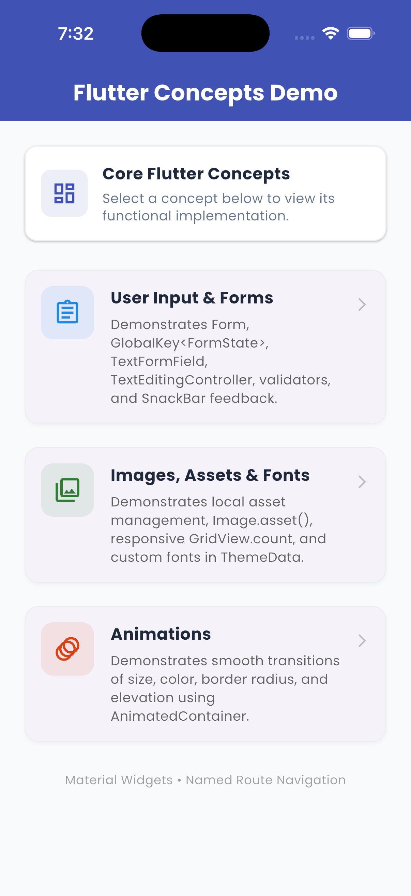
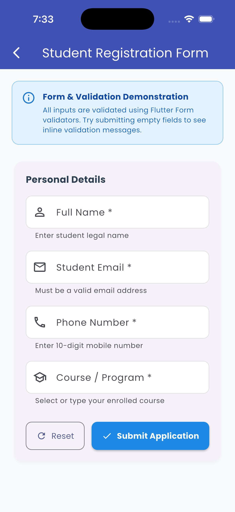
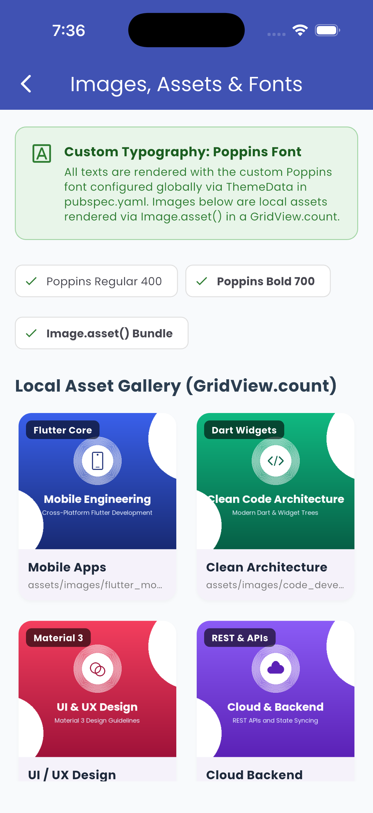
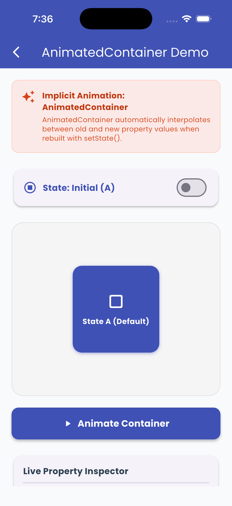
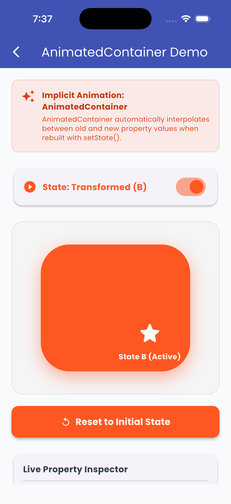

# assignment_4_concepts_demo

A new Flutter project.

## Getting Started

This project is a starting point for a Flutter application.

A few resources to get you started if this is your first Flutter project:

- [Learn Flutter](https://docs.flutter.dev/get-started/learn-flutter)
- [Write your first Flutter app](https://docs.flutter.dev/get-started/codelab)
- [Flutter learning resources](https://docs.flutter.dev/reference/learning-resources)

For help getting started with Flutter development, view the
[online documentation](https://docs.flutter.dev/), which offers tutorials,
samples, guidance on mobile development, and a full API reference.

A Flutter application developed to demonstrate three important Flutter development concepts in a single application:

- 📝 User Input & Forms
- 🖼️ Images, Assets & Fonts
- 🎬 Animations using `AnimatedContainer`

The application also demonstrates navigation between different screens using Flutter's named route navigation.

---

## 📌 Assignment Objective

The objective of this assignment is to develop a Flutter application that demonstrates:

1. Accepting and validating user information using Flutter's `Form`, `TextFormField`, and validation mechanisms.
2. Displaying local images using `Image.asset()` and applying a custom font to the application.
3. Creating a simple interactive animation using `AnimatedContainer`.
4. Navigating between different screens using named routes.

---

# 📱 App Screenshots

## 🏠 Home Screen

<table>
  <tr>
    <td align="center">
      
      <br><br>
      <b>01_home_screen.png</b>
    </td>
    <td align="center">
      
      <br><br>
      <b>02_form_screen.png</b>
    </td>
  </tr>
</table>

---

## 🖼️ Images, Assets & Fonts

<table>
  <tr>
    <td align="center">
      
      <br><br>
      <b>04_images_assets_fonts.png</b>
    </td>
    <td align="center">
      
      <br><br>
      <b>05_animation_before.png</b>
    </td>
  </tr>
</table>

---

## 🎬 Animation — After State

<p align="center">
  
  <br><br>
  <b>06_animation_after.png</b>
</p>

---

# 🧩 Application Structure

```text
                         🏠 HomeScreen
                              │
              ┌───────────────┼───────────────┐
              │               │               │
              ▼               ▼               ▼
       📝 User Input     🖼️ Images,        🎬 Animations
          & Forms         Assets & Fonts
              │               │               │
              ▼               ▼               ▼
        Form Screen       Image Grid    AnimatedContainer
